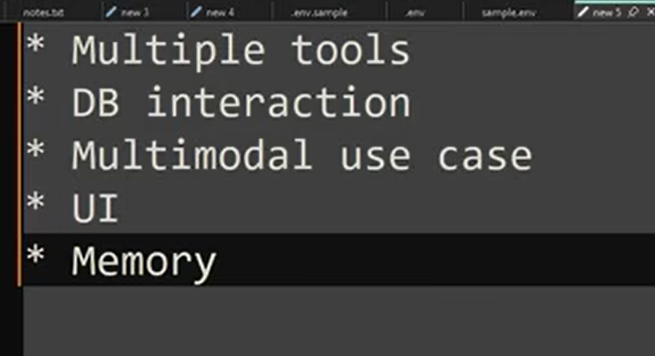
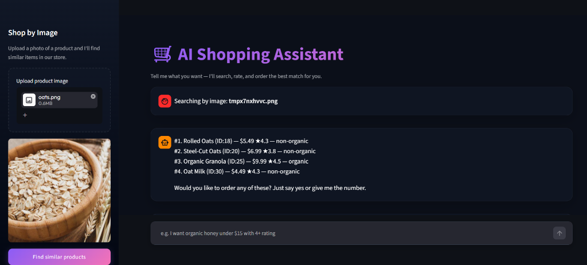

# Multimodal AI Shopping Assistant

This project implements a multimodal AI shopping assistant using Streamlit, LangChain, Groq LLMs, SQLite, and FAISS. It supports natural language product search, image-based product discovery, customer rating retrieval, simulated order placement, persistent user preferences, and policy lookups through a local RAG pipeline.

---

## Why I Built This

I wanted to explore how LLM agents can interact with structured databases and retrieval systems instead of only generating text.

The project combines tool calling, RAG, multimodal search, memory, and automated evaluation to explore practical agentic AI workflows.

---

## Demo

### Chat Interface & Ordering Flow


### Multimodal Image Search


---

## Architecture

```text
User
  ↓
Streamlit UI
  ↓
LangChain Agent
  ├── Product Search Tool
  ├── Ratings Tool
  ├── Checkout Tool
  ├── Memory Tool
  └── RAG Retrieval Tool
  ↓
SQLite + FAISS
```

---

## 📦 What is in the Project

The codebase consists of:

### 1. Database & Catalog
*   **SQLite Database (`store.db`)**: Stores catalog items, customer reviews, order logs, and user preferences.
*   **Products Catalog**: Features 32 items across categories like honey, cooking oils, nuts, grains, tea, coffee, snacks, and milk alternatives.
*   **Customer Reviews**: Contains simulated reviews used to calculate average star ratings for products.

### 2. Search & Retrieval (RAG)
*   **Unstructured Knowledge (`store_info.txt`)**: A text file containing store policies (returns, shipping) and product care/storage instructions.
*   **Vector Search Index (`faiss_index/`)**: The assistant can answer store-related questions (shipping, returns, product storage instructions) using a local FAISS vector database built from store documentation.

### 3. AI Agent
*   **AI Agent**: The assistant uses LangChain and Groq models to reason about user requests and decide which tools to invoke. Additional safety checks are implemented to filter off-topic requests before they reach the agent.
*   **Multimodal search**: Built using separate text and vision models to allow users to upload product images and search for similar items.

### 4. Frontend Interface
*   **Streamlit Web App (`app.py`)**: A chat web interface styled with custom CSS (glassmorphism chat bubbles, Outfit font, and slate color styling).

### 5. Automated Evaluation
*   **Evals Runner (`run_evals.py`)**: A script that runs test queries through the agent to check if the correct tools are invoked and responses meet format guidelines.

---

## ⚙️ Setup & How to Run

### Step 1: Clone and install dependencies
```bash
git clone <your-repo-link>
cd Shopping_Agent_Project
pip install -r requirements.txt
```

### Step 2: Configure Environment Variables
Create a file named `.env` in the root folder and add your Groq API key:
```env
GROQ_API_KEY=your_groq_api_key_here
```

### Step 3: Populate the Database
Run the SQLite database initialization script:
```bash
python setup_db.py
```

### Step 4: Build the RAG Index
Compile the local FAISS vector database from the policies text:
```bash
python setup_vector_db.py
```

### Step 5: Launch the Streamlit App
Start the local web server:
```bash
streamlit run app.py
```

### Step 6: Run Evaluations
To verify tool-calling routing and formatting:
```bash
python run_evals.py
```

---

## 📁 Key File Descriptions
*   `app.py`: Streamlit frontend layout, guardrails, and message loops.
*   `shopping_agent.py`: LangChain tools, LLM configs, database helpers, and prompt rules.
*   `setup_vector_db.py`: Scripts to parse `store_info.txt`, embed text, and save the local FAISS index.
*   `store_info.txt`: Text guidelines for returns, shipping, and product care.
*   `reviews_api.py`: Python module to read ratings from the SQLite DB.

---


